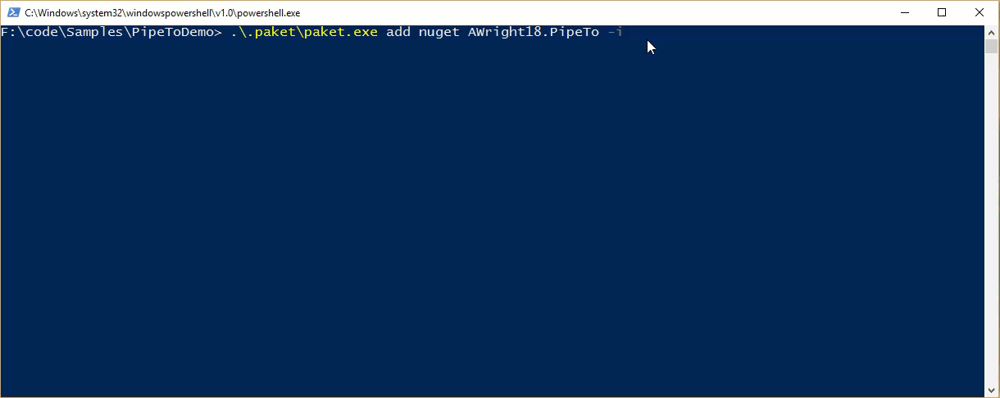

# AWright18.PipeTo  

## What does it do? 
PipeTo was created to allow you to pipe the results of a method call or function call to another method or function call.  It was Inspired by the F# forward pipe operator that looks like this |>. 

Here is a simple example of something you might do with PipeTo. 

```csharp

        static void Main(string[] args)
        {
            "Hello"
                .PipeTo(AddFrom)
                .PipeTo(AddWho, "Awright18.PipeTo")
                .PipeTo(Console.WriteLine);
        }

        static string AddFrom(string s)
        {
            return s + " from";
        }

        static string AddWho(string s, string who)
        {
            return s + " " + who;
        }

```

## How do I install it? 

Using [Nuget](https://www.nuget.org/) [https://www.nuget.org/packages/AWright18.PipeTo](https://www.nuget.org/packages/AWright18.PipeTo/)


Using Paket

You can use the [packet add](http://fsprojects.github.io/Paket/paket-add.html) command.  

packet add nuget AWright18.PipeTo -i 




Or simply add it to your paket.dependencies file by hand. 


Then run paket install


## Using AWright18.PipeTo

### NOTE: All of the following examples will print "Hello from AWright18.PipeTo" to the console. 

### A value Piped to a System.Action that takes one argument

```csharp 

    "Hello From AWright18.PipeTo".PipeTo(Console.WriteLine);

```

### A value Piped to an System.Action that takes two arguments

```csharp

    "Hello From {0}".PipeTo(Console.WriteLine,"AWright18.PipeTo");

```

### A value Piped to a System.Func that takes one argument and returns another argument

```csharp 

    var helloWorld = "Hello From AWright18.PipeTo".PipeTo((s) => s);

    helloWorld.PipeTo(Console.WriteLine);
``` 

### A value Piped to a System.Func that takes two arguments and returns another argument

```csharp

    var helloWorld = "Hello From {0}".PipeTo(string.Format,"AWright18.PipeTo");

    helloWorld.PipeTo(Console.WriteLine);

```


### Creating a pipe line of multiple functions.

```csharp

        static void Main(string[] args)
        {
            "Hello"
                .PipeTo(AddFrom)
                .PipeTo(AddWho, "Awright18.PipeTo")
                .PipeTo(Console.WriteLine);
        }

        static string AddFrom(string s)
        {
            return s + " from";
        }

        static string AddWho(string s, string who)
        {
            return s + " " + who;
        }

```

### Alternatively of course you can use lambda expressions 

```csharp 
    static void Main(string[] args)
    {
        "Hello"
            .PipeTo((value) => value + " from")
            .PipeTo((value,who) => value + " " + who,"AWright18.PipeTo")              
            .PipeTo(Console.WriteLine);
    }
```


