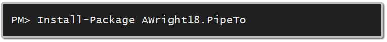

# Installation

## Nuget
Using [Nuget](https://www.nuget.org/) [https://www.nuget.org/packages/AWright18.PipeTo](https://www.nuget.org/packages/AWright18.PipeTo)

From the Package Manager Command Line

From Visual Studio "Manage Packages"

## Paket [http://fsprojects.github.io/Paket/](http://fsprojects.github.io/Paket/)

You can use the [packet add](http://fsprojects.github.io/Paket/paket-add.html) command.  

packet add nuget AWright18.PipeTo -i 

Or simply add it to your paket.dependencies file by hand. 

Then run paket install
